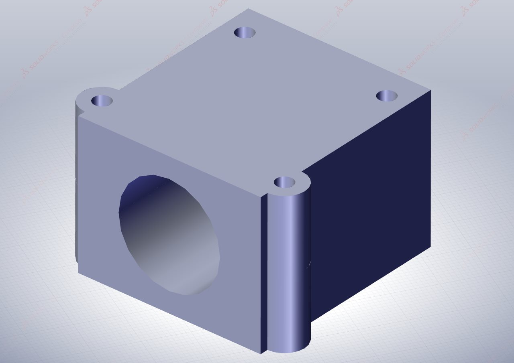
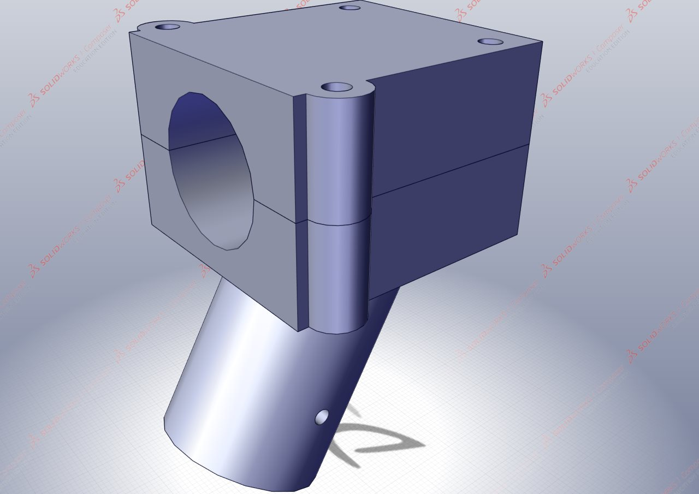

# Rotorboom Mounts

The Rotorboom Mounts assist in two ways, firstly to connect the rotorbooms (arms) of the HexaQuad to the central hub of the drone. Secondly, they provide an attachment point for the landing gear to the central hub.

Thus there are two configurations this doc covers: a rotorboom mount that accommodates the landing gear and the rotorboom; and a configuration that accommodates the rotorboom only.

# Mounts Differences

## Top Rotorboom Mount

 

The top mount is used in both configurations, that accommodating the landing gear and the rotorboom only.

## Bottom Rotorboom Mount

The bottom mount is used only in the case when landing gear is required to be attached to the rotorboom.

# Configurations

## Rotorboom Only
This configuration onlt requires the top mount.

**Required 3D prints:**

- 2 x [LGLegTopMount](https://github.com/landrs-toolkit/LANDRs-Science-Drone/blob/main/Design/MechanicalDesign/RotorBoomMounts/NutInsert/LGLegMountTopV3.2NutInsert.STL)

**Illustration:**

## Rotorboom and Landing Gear

This configuration makes use of both the top and bottom mounts.

**Required 3D prints:**

- 1 x [LGLegTopMount](https://github.com/landrs-toolkit/LANDRs-Science-Drone/blob/main/Design/MechanicalDesign/RotorBoomMounts/NutInsert/LGLegMountTopV3.2NutInsert.STL)
- 1 x [LGLegBotMount](https://github.com/landrs-toolkit/LANDRs-Science-Drone/blob/main/Design/MechanicalDesign/RotorBoomMounts/LGLegMountBotV3.1.STL)

**Illustration:**

