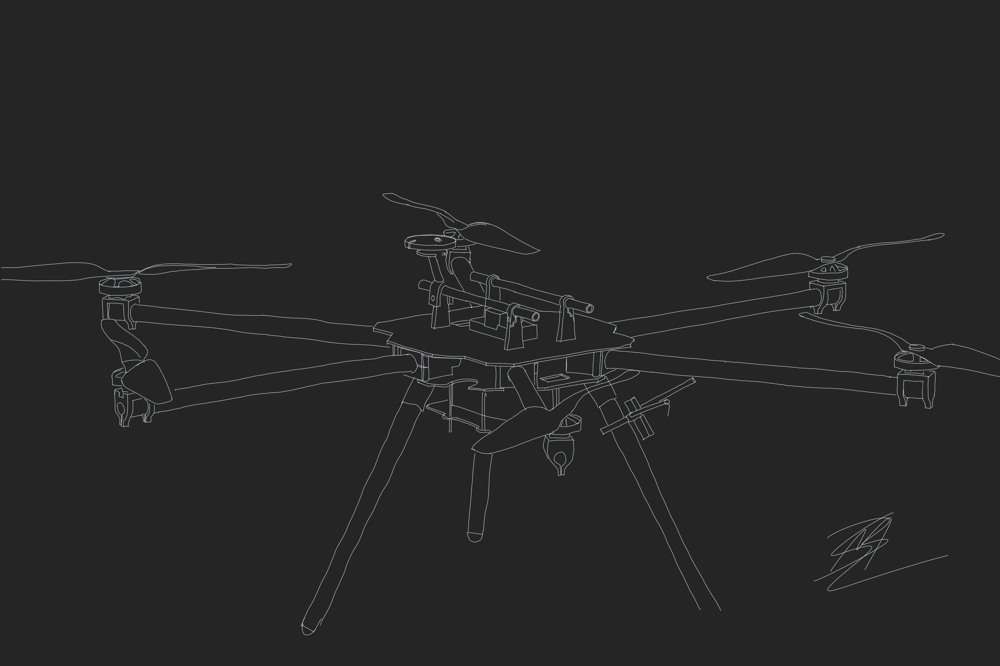

# Nyala HexaQuad

This will become the primary source for all design materials and user guides for this drone.

**Status:**
* Drone is undergoing performance testing, see provisional flight performance [here](https://youtu.be/huQ6nF6V_Ks)
* Repo currently primarily contains CAD Drawings related to the 3D printable parts and CNC'd parts.
* This repo intends to release version 1 before the end of 2022

**Documentation**

[Docs](https://www.landrs.org/LANDRs-Science-Drone/)

**License**
Licensed under [CERN-OHL-P v2](https://cern.ch/cern-ohl) permissive bariant or later.
