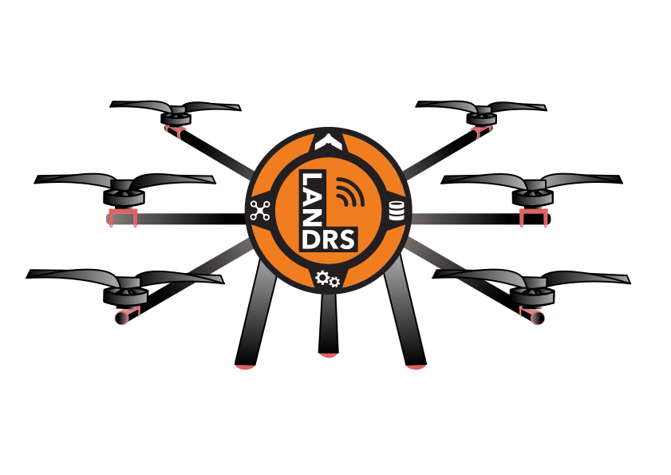

# Nyala HexaQuad

**Welcome to the primary source for all the design materials and users guides for the LANDRS Nyala HexaQuad.**

The HexaQuad is an open source, modular multirotor designed with stringent academic research data provenance in mind.
It is a simple to replicate, user friendly design for drone novices and experts alike, all you need are some basic tools, a 3D printer and once off access to CNC routing.

**Specifications:**
* 15-20 minutes operation time with 1-3kg payload
* Configured as Hex or Quad
* Max flight time: 30 - 35 minutes (16.8Ah)
* Max Payload: 2kg(Quad); 5kg(Hex)
* Battery Voltage: 6S

A short description of the HexaQuad can be found on YouTube [here](https://youtu.be/huQ6nF6V_Ks) and detailed specifications can be seen below.

## Documentation

The documentation can be found at [https://www.landrs.org/LANDRs-Science-Drone/](https://www.landrs.org/LANDRs-Science-Drone/). This will house the build instructions, assistance guides and all information relating to the HexaQuad.

## Presentation at Linux Open Source Summit Europe 2022
We were invited to present our work at the Linux Open Source Summit that took place in Dublin, 2022. The Linux foundation flew us out to present our work to the open source community.

The full presentation given at the summit can be found on YouTube [here](https://youtu.be/drAO9xs3WeU).

In the presentation we explore the motivation for the HexaQuad and how it can benefit researchers compared to drones available off the shelf. There is further exploration of the design considerations and performance.

## License
Licensed under [CERN-OHL-P v2](https://cern.ch/cern-ohl) permissive variant or later.

## Citation
If using the work presented here, please use one of the following citation:

> **APA**: Borrageiro, M. G., & Wyngaard, J. Nyala HexaQuad, LANDRs' Science Drone (Version 1.0.0) [Designs]. https://github.com/landrs-toolkit/LANDRs-Science-Drone

> **BibTex**: @misc{Borrageiro_Nyala_HexaQuad_LANDRs,
author = {Borrageiro, Mauro Giovanni and Wyngaard, Jane},
title = {{Nyala HexaQuad, LANDRs' Science Drone}},
url = {https://github.com/landrs-toolkit/LANDRs-Science-Drone}
}

## Detailed Specifications:
| **Model**                             | **General**                                               |
|-------------------------------------------|-----------------------------------------------------------------|
| Flight Controller                         | Cubepilot Orange Cube                                           |
| Autopilot                                 | Arducopter 4.3.1                                                |
| Navigation                                | Here 2 GPS                                                      |
| Remote Control                            | FrSky Archer GR8 ACCESS (Receiver), Taranis Q X7S (Transmitter) |
| Telemetry Radio                           | RFD900+ 900MHz radios                                           |
| Operating Range (km)                      | 2                                                               |
| Battery Voltage (V)                       | 22.2 (3.7x6)                                           |
| Battery Capacity (Ah)                     | 8.4 - 16.8                                                      |
| Motor                                     | T-Motor MN5008 340KV 6S                                         |
| Propeller                                 | T-Motor P18x6.1 Carbon Fiber                              |
| Wingspan (mm)                             | 1120 (no props), 1578 (props on)                                |
|                                           | **Hexacopter**                                             |
| Configuration                             | Hex-X                                                           |
| Dimensions (W x L x H mm)    | 1120 x 970 x 450                                        |
| Frame Weight (kg)                         | 2.7                                                             |
| AUW, No battery (kg)                | 3.7                                                             |
| AUW(kg)                             | 4.6 - 5.5                                                       |
| Max Thrust (N)                            | 246                                                             |
| Max Payload (kg)                          | 5                                                               |
| Typical Flight Time (1kg, min)            | 28.8                                                            |
| Maximum Flight Time (min)                 | 19.2 - 30.6                                                     |
|                                           | **Quadcopter**                                             |
| Configuration                             | Quad-X                                                          |
| Dimensions (W x L x H mm)     | 792 x 792 x 450                                         |
| Frame Weight (kg)                         | 2.2                                                             |
| AUW, No battery (kg)                | 2.9                                                             |
| AUW(kg)                             | 3.8 - 4.6                                                       |
| Max Thrust (N)                            | 165                                                             |
| Max Payload (kg)                          | 2                                                               |
| Maximum Flight Time, single battery (min) | 23                                                              |

## Contact Details
You can connect with me on LinkedIn or via Email:

[Mauro-Borrageiro-87a5131b5](https://www.linkedin.com/in/mauro-borrageiro-87a5131b5/)

[brrmau002@myuct.ac.za](brrmau002@myuct.ac.za)
