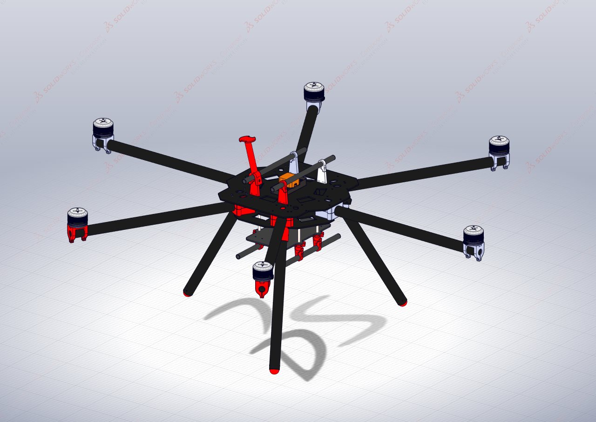
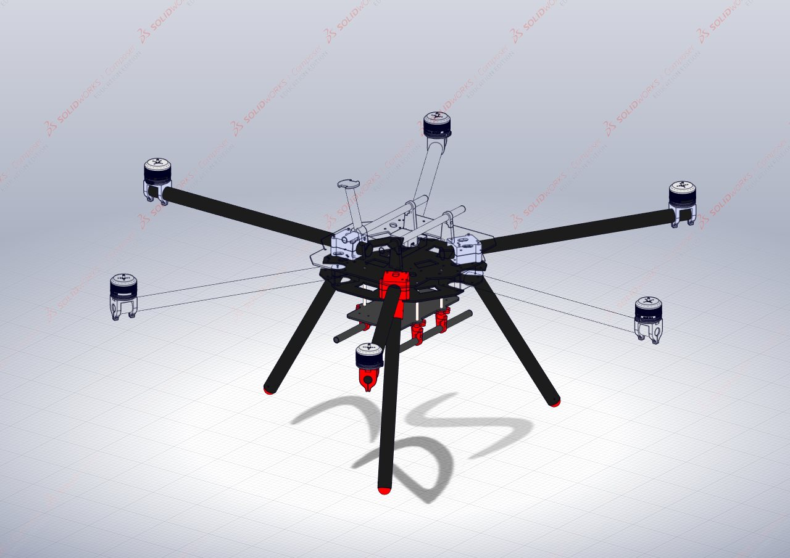
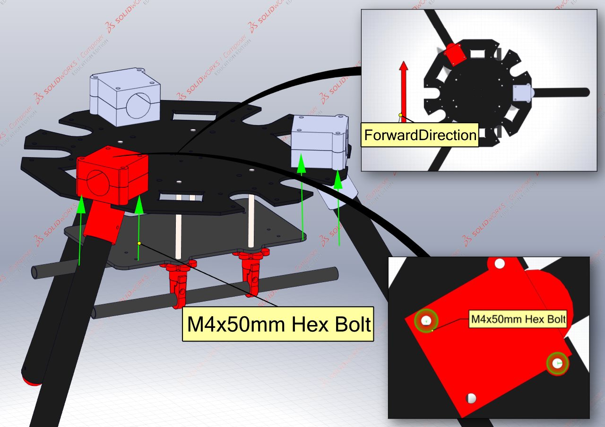
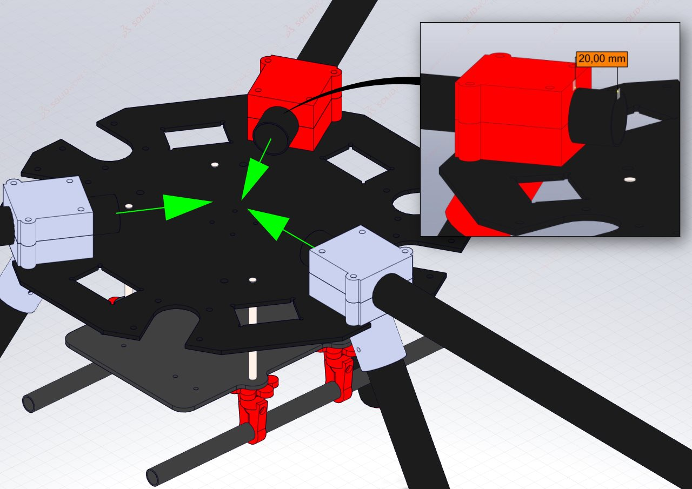
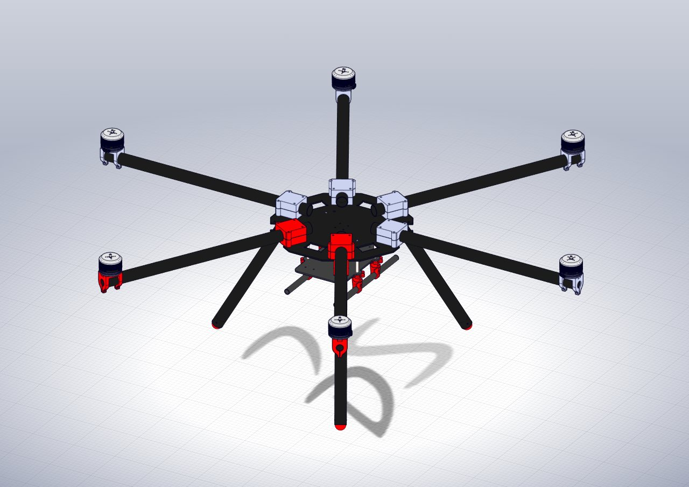

# Assembly of the HexaQuad
{: .no_toc }
This section will illustrate how to assemble the HexaQuad using the Hex configuration as an example, any differences with the Quad configuration will be highlighted when necessary.
These instructions are going to use all the previous assemblies constructed in the previous steps

## Table of Content:
{: .no_toc .text-delta }

1. TOC
{:toc}

## Requirements: 

### Hex Parts:

| Component              | Quantity | Description                          |
|:------------------------|:--------------|:-------------------------|
|[Rotorboom](../../GettingStarted/BuildInstructions/Rotorbooms.md)|6| Assembled rotorbooms|
|[Landing Gear](../../GettingStarted/BuildInstructions/LandingGear.md)|3|Assembled carbon fiber rod landing gear|
|[Battery & Bottom Plate](../../GettingStarted/BuildInstructions/BatPlate.md)|1|Assembled bottom and battery plates|
|[Top Plate](../../GettingStarted/BuildInstructions/TopPlate.md)|1|Top plate with the flight controller and rails connected|
|M4x50mm Bolts|12|Hex socket bolts to secure plates|
|M4 Standard Nuts|12|Standard nuts to secure plates|
|M4 Standard Washers|24|Standard washers to secure plates|

### Quad Parts:

| Component              | Quantity | Description                          |
|:------------------------|:--------------|:-------------------------|
|[Rotorboom](../../GettingStarted/BuildInstructions/Rotorbooms.md)|4| Assembled rotorbooms|
|[Landing Gear](../../GettingStarted/BuildInstructions/LandingGear.md)|4|Assembled carbon fiber rod landing gear|
|[Battery & Bottom Plate](../../GettingStarted/BuildInstructions/BatPlate.md)|1|Assembled bottom and battery plates|
|[Top Plate](../../GettingStarted/BuildInstructions/TopPlate.md)|1|Top plate with the flight controller and rails connected|
|M4x50mm Bolts|8|Hex socket bolts to secure plates|
|M4 Standard Nuts|8|Standard nuts to secure plates|
|M4 Standard Washers|16|Standard washers to secure plates|

### Tools:
- A hand drill is useful and saves time and energy
- Socket set to tighten the nuts

## Assembling the HexaQuad
These instructions make use of the Hex configuration as an example however the Quad assembly is very similar and an variations will be identified.

Before assembly begins, make sure to identify the correct mounting holes for the desired configuration.
The landing gear, rotorboom and battery plate mounting holes for the Hex and Quad configurations are highlighted below:

The circles in the figure above indicate rotorboom and landing gear mounting locations.
The **blue circles** are for the **Quad** and the **red circles** are for the **Hex**.
Guidance on choosing the best Hex landing gear locations will be highlighted below. The Quad configuration requires landing gear at all the rotorboom locations.

### Step 1, *Mounting the landing gear to the bottom plate*

Align the landing gear mounts into their mounting locations as identified in the mounting hole image above.
To secure the landing gear and rotorbooms, a minimum of two **M4x50mm** hex bolts and washers are required per mount, it is further suggested to use washers on the top and bottom carbon fiber plates to prevent damage.

Do not fasten the bolts tightly as the rotorbooms still need to be inserted.

### Step 2, *Adding the Rotorbooms*
When inserting the rotorbooms, ensure the inner ends of the carbon fiber tubes are 20mm away from the back of the 3D printed mount, as seen in the Figure below:

*A useful tip is to mark this point on the carbon fiber tubes to make replacement quick and avoid measurement each time.*

Tighten the M4 bolts by hand.
The final result of placing all the rotorbooms should look as follows:

### Step 3, *Connecting all the power distribution wires*
With all the rotorbooms inserted and semi-secured, connect the motor power distribution cables which were created in the PDB section of the guide.

All the wires are the same and do not need to connect to a specific motor, however, it is encouraged to perform this operation with cable management in mind.

All other relevant wires for the directional LEDs and power distribution for the peripheries should be connected now too.

### Step 4, *Connect the Top Plate*
With the PDB secured and all the relevant wires connected the top plate can be put in place.
Once the plate is in place, the **M4** bolts can be secured with the relevant nuts and washers.

With the top plate in place the drone constrution is complete and should look as follows:

[Previous Section](../../GettingStarted/BuildInstructions/PDB.md){: .btn} [Next Section](../../GettingStarted/BuildInstructions/Assembly.md){: .btn .float-right}
