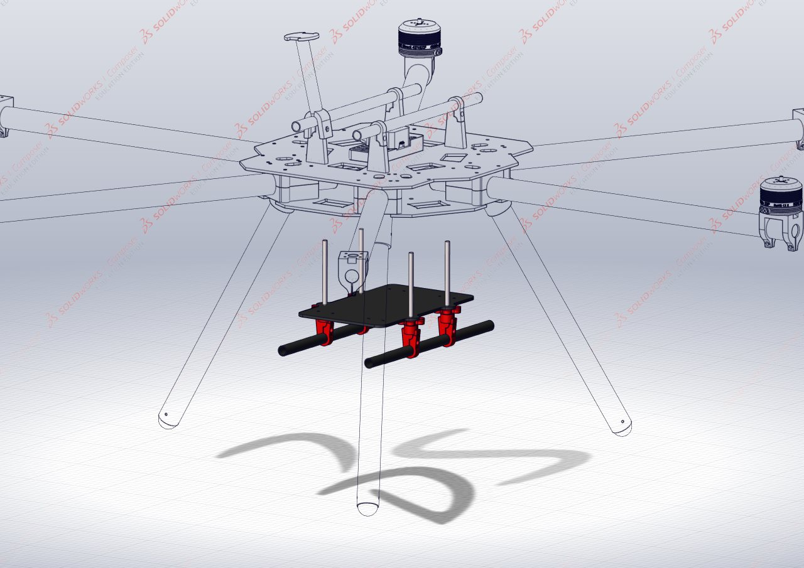
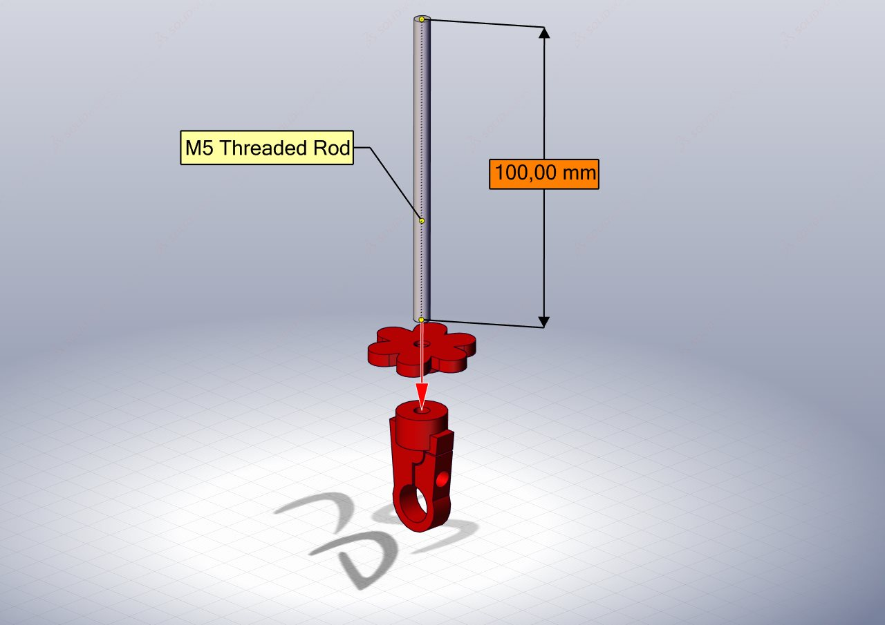
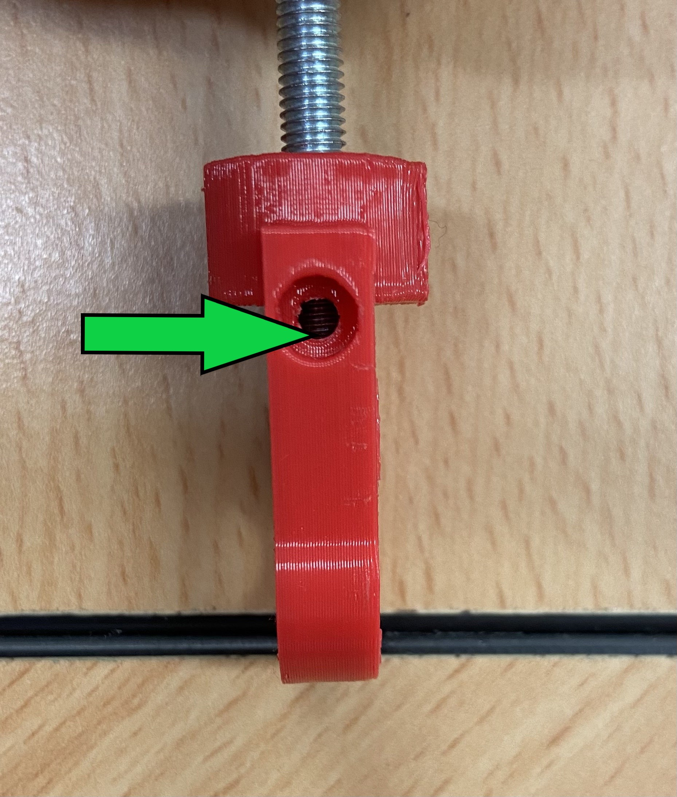
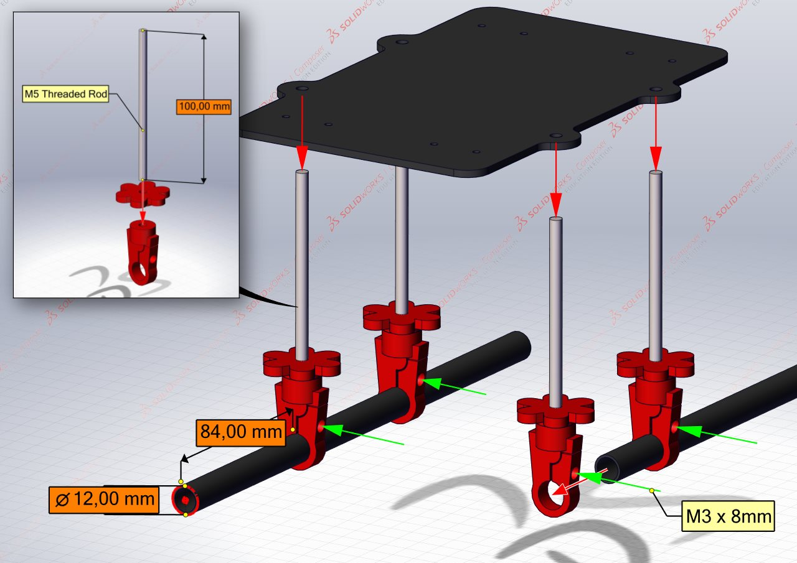
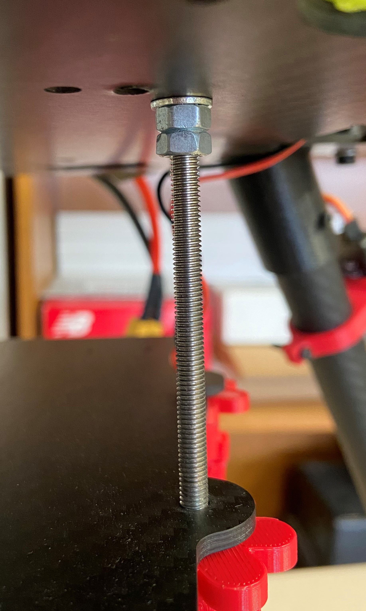
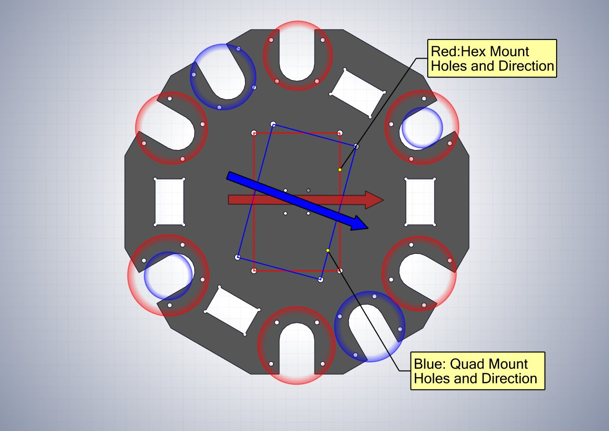
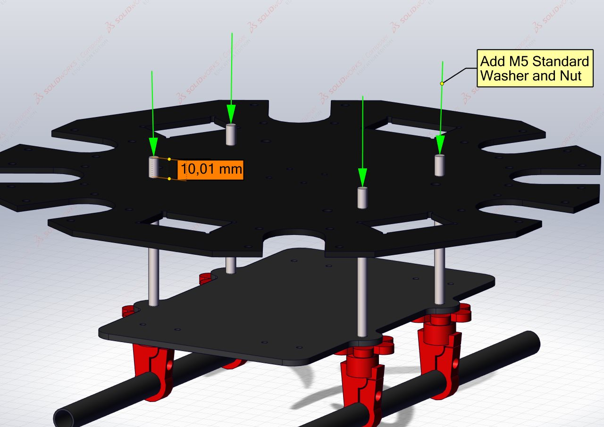

# Bottom Plates of the Central Hub
{: .no_toc }
This section focuses on assembling the bottom plates of the central hub, including the battery plate and its associated rail mounts as well as how they are secured to the bottom dodecagon plate.

## Table of Content:
{: .no_toc .text-delta }

1. TOC
{:toc}

## Requirements: 

### Parts:

| Component              | Quantity | Description                          |
|:------------------------|:--------------|:-------------------------|
| [Battery Plate](https://github.com/landrs-toolkit/LANDRs-Science-Drone/tree/main/Design/MechanicalDesign/BatteryPlate) | 1 | CNC'd carbon fiber plate |
| [Dodecagon Bottom Plate](https://github.com/landrs-toolkit/LANDRs-Science-Drone/tree/main/Design/MechanicalDesign/CenterHubs/BottomPlate) | 1 | CNC'd carbon fiber plate |
| [Wing Nut Extender](https://github.com/landrs-toolkit/LANDRs-Science-Drone/tree/main/Design/MechanicalDesign/BatteryPlate) | 4| 3D Printed wing nut extender   |
| [Bottom Rail Mount](https://github.com/landrs-toolkit/LANDRs-Science-Drone/tree/main/Design/MechanicalDesign/RailMounting) | 4 | 3D Printed bottom rail mount |
| Gimbal Rails | 2 | 12x10x250mm carbon fiber tube|
| M5 x 100mm Threaded Rod | 4| M5 threaded rod to secure battery plate|
| M5 Standard Nut | 12| M5 standard nut to secure threaded rods to bottom plate|
| M5 Standard Washer | 12| M5 washer to prevent damage to carbon fiber plates|
| M3 x 8mm bolt | 4 | M3 hex socket bolts for gimbal mounts|

## Assembling the Bottom part of the Central Hub:
The following illustrations will assist with assembling the components associated with the bottom plates of the central hub. 

### Step 1: *Bottom gimbal rail mounts*
The battery plate and bot gimbal rails are secured to the dodecagon bottom plate with **M5 Threaded Rod**. This step must be repeated 4 times.

On the bottom end of a **M5 x 100mm** threaded rod, thread on a Wing Nut Extender. Slide on a **Standard M5 Washer** on the top side of the Wing Nut.
Ensure theres enough room below the Wing Nut to secure the Rail Mount.

When threading on the Bottom Rail Mount, thread the rod in just enough to see it pass the top hole on the side of the printed mount. The thread should pass the point of the arrow below.

*Note: You may thread the threaded rod as far as it will go however it will leave less thread to work with when securing the rods to the bottom plate of the central hub.*

### Step 2: *Securing the gimbal rails and battery plate*
With the 4 assembled bottom gimbal rail mounts, slide on the Battery Plate as illustrated.

The carbon fiber rails can then be secured in the rail mounts, the end of the rail should be **84mm** from the rail mount. Use **M3 x 8mm** hex socket bolts to secure the rails in place.

### Step 3: *Locking nuts to secure the battery plate to the dodecagon plate*
The Battery Mounting Plate and Rails are secured to the Bottom Dodecagon plate by means of "locked" nuts.

On each of the threaded rods, thread 2 **M5** standard nuts approximately 15mm down the rod. Then place a **M5** standard wash on top of the nuts.

The nuts are "locked" by threading them towards each other until they are tight, this is easier to do with spanners.

### Step 4: *Securing the battery plate to the dodecagon plate*
There are two sets of possible mount holes on the bottom dodecagon plate. The following illustration assists with choosing the correct holes depending on the configuration you are assembling.

*Suggestion: use markers or a pencil to mark which holes for the respective configurations*

Satisfied the correct holes have been chosen, the bottom plate mount holes can be aligned with the threaded rods and pushed through. The Bottom Plate should rest on the locked nuts from the previous step.

Then add a standard **M5** washer and nut to the top of each threaded rod. Tighten the nut to secure the Bottom Dodecagon Plate to the Battery Plate assembly.

*Note: You may need to slightly adjust nut heights on each threaded rod to ensure the battery plate is as close to level as possible.*

[Previous Section](../../GettingStarted/BuildInstructions/TopPlate.md){: .btn} [Next Section](../../GettingStarted/BuildInstructions/PDB.md){: .btn .float-right}