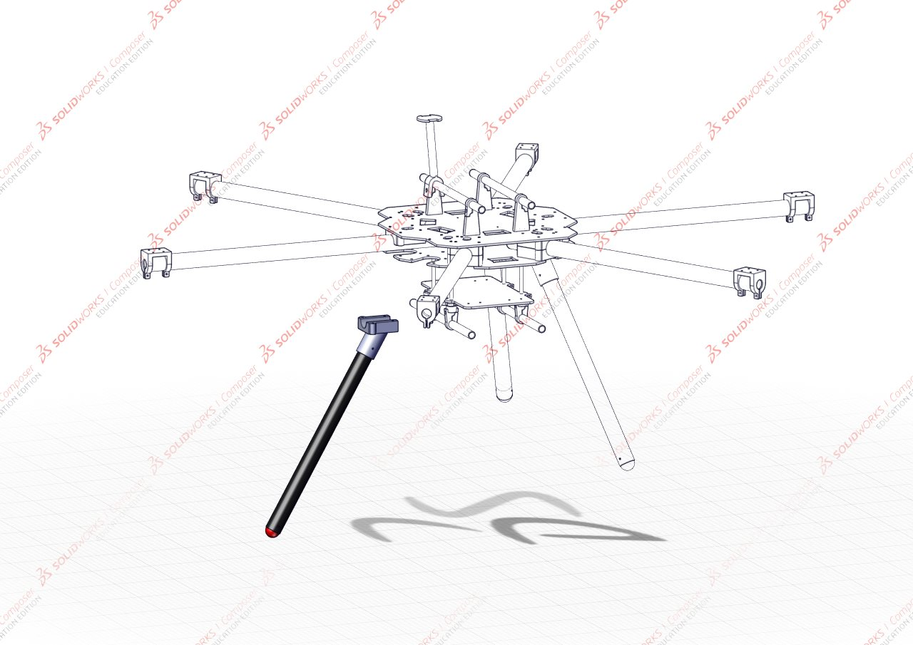
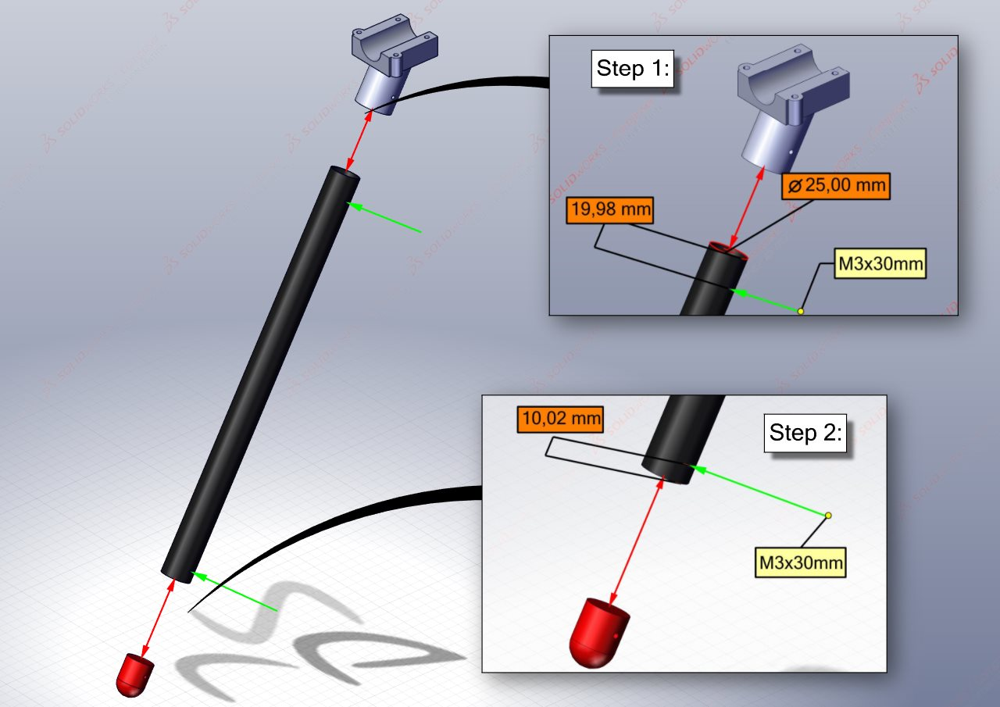

# Landing Gear
{: .no_toc }
We start our assembly with the landing gear. These are simple structures and can be assembled almost completely before being added to the rest of the frame. The landing gear of the HexaQuad is extremely simple and was designed as such to be easy to replace and avoid breaking in the case of a crash.

## Table of Content:
{: .no_toc .text-delta }

1. TOC
{:toc}

## Requirements: 

### Parts:

| Component              | Hex Quantity | Quad Quantity | Description                          |
|:------------------------|:--------------|:---------------|:--------------------------------------|
| [Landing Gear Tube Cap](https://github.com/landrs-toolkit/LANDRs-Science-Drone/tree/main/Design/MechanicalDesign/LandingGear)               | 3            | 4             | Foot of landing gear                 |
| Carbon Leg             | 3            | 4             | 25x23x350mm length of carbon tube    |
| [Bottom Rotorboom Mount](https://github.com/landrs-toolkit/LANDRs-Science-Drone/tree/main/Design/MechanicalDesign/RotorBoomMounts/NutInsert) | 3            | 4             | Landing gear mount to connect to hub |
| M3 30mm bolt           | 6            | 8             | M3 socket head 30mm bolt             |
| M3 standard Nut        | 6            | 8             | M3 standard nut for 3D prints        |

## Assembling the Landing gear:

The following illustrations will assist with assembling the landing gear of the HexaQuad. Repeat the following steps 3 times for Hex or 4 times in the case of the Quad configuration.

### Step 1: *Fit the landing gear tube cap*

Slide the landing gear tube cap into the lower end of the carbon fiber tube. The lower end is identified by a securing hole located 10mm from the end of the tube.

### Step 2: *Fit the rotorboom bottom mount*

The rotorboom bottom mount slides onto the top end of the carbon fiber tube. The top end of the carbon fiber tube is identified by a securing hole located 20mm from the end of the tube.

### Step 3: *Secure the prints with M3 bolts*

Taking two **M3x30mm** hex socket bolts, allign the holes and thread the bolts through. 

*Incase the bolts are loose, rather use M3x35mm and a standard M3 nut to secure the tube cap and rotorboom mount.*

