# Power Distribution
{: .no_toc }
This section will outline the connections of all the power carrying lines in the HexaQuad. It will detail motor connections, current sensor mounting, battery connections and periphery power connections for sensors and the autopilot. All connections will be related to the power distribution board (PDB).

*Note: These soldering instructions are only a suggestion and reference what was done in the prototype build. There are a number of other ways to create the connections outlined here, optimisation for individual cases is encouraged*

## Table of Content:
{: .no_toc .text-delta }

1. TOC
{:toc}

## Requirements: 

### Parts:

| Component              | Quantity | Description                          |
|:------------------------|:--------------|:-------------------------|
| [Matek Hex PDB](http://www.mateksys.com/?portfolio=pdb-hex) | 1 | 4-14S Power distribution board (PDB)|
| [Mauch PL-200](https://www.mauch-electronic.com/pl-xxx-sensor-boards) | 1 | Current Sensor |
| XT90-S Male | 1| Nylon wire connector with anti-spark protection |
| XT30 Male| 2 | Nylon connector|
| [PDB Mount](https://github.com/landrs-toolkit/LANDRs-Science-Drone/blob/main/Design/MechanicalDesign/PDBMount/PDBMount.STL) | 1 | 3D printed mount to secure the PDB to the bottom plate|
| Heavy Duty Velcro | 1 | 30x30mm square of velcro to secure the PDB|
| 3.5mm Female Bullets | 12 | 3.5mm female bullet connectors|
| M3 x 12mm bolt | 2 | M3 hex socket bolts to secure the PDB|
| M3 Insulator Nut | 2 | M3 plastic isolator to prevent short circuits|

## Matek Documentation:
A Matek manual for the PDB can be found [here](http://www.mateksys.com/?portfolio=pdb-hex#tab-id-1). They provide a brief instruction set for connections of either a hexacopter or a quadcopter.

## Assembling the Bottom part of the Central Hub:
The following illustrations will assist with soldering all the required components to the PDB and its extensions. The illustrations will make use of images and diagrams for more detail.

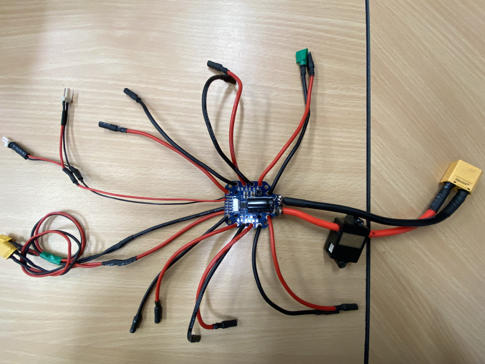

### Step 1: *Soldering on the capacitor*
There is an input capacitor that must be soldered at the input of the PDB. The provided capacitor has a capacity of 390 micro farad and is polarised (dedicated positive and negative side).

Guide the capacitors leads through the provided holes and solder on the bottom pads

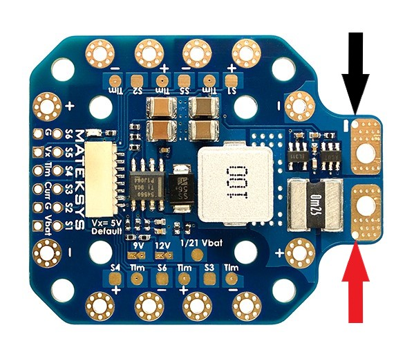

The capacitor can then be bent over as follows to reduce the height of the PDB form factor.

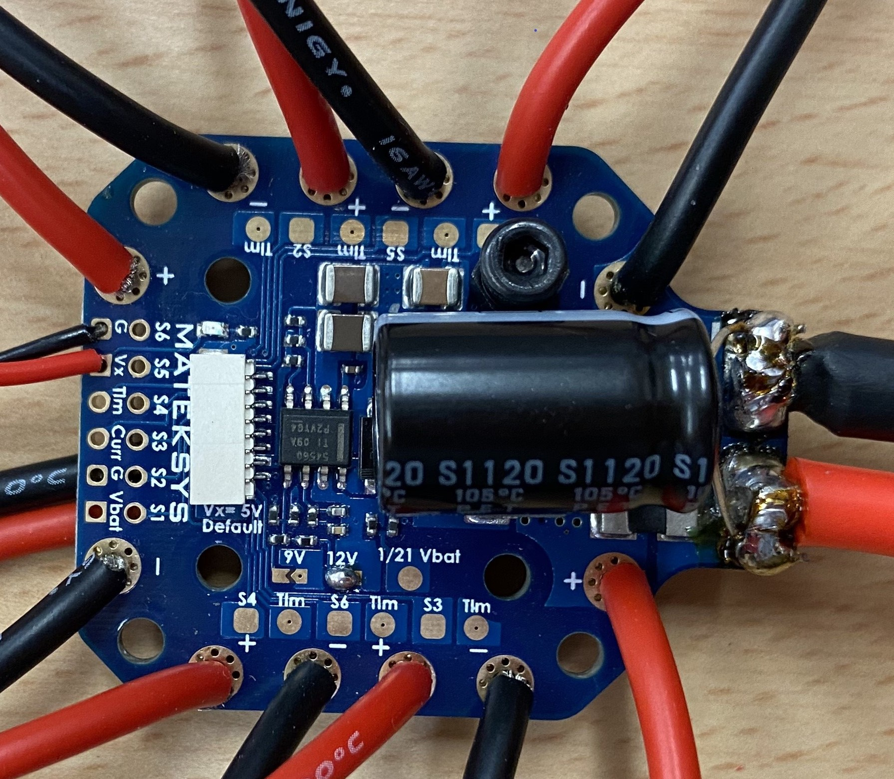

### Step 2: *Input wires and current sensor*
The PL-200 current sensor is connected to the input pads of the PDB. This ensures the current reading includes the actual current draw from the batteries.

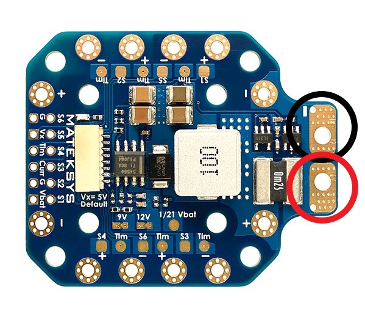

The current sensor has a direction of use, the current flow direction can be identified by opening the carbon fiber protective housing.

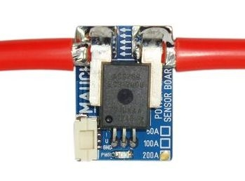

The free end of the current sensor is connected to an **XT90** nylon connector. The entire connection should look as follows:

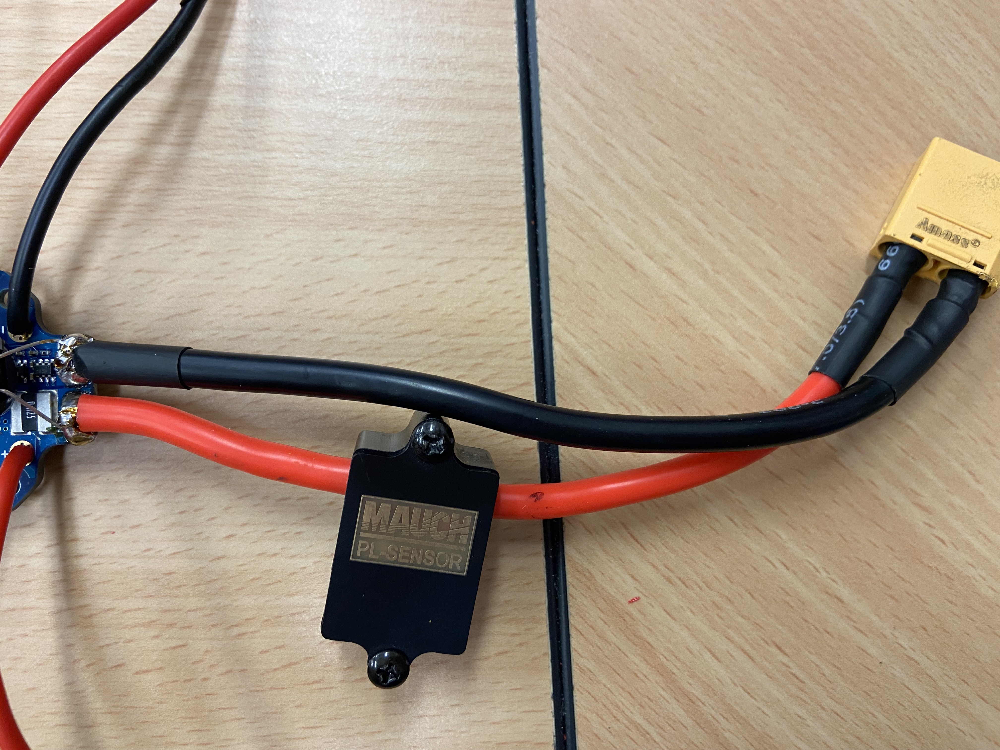

### Step 3: *Soldering on the motor wires*
The next step is to connect the motor connections. The following highlights the conductive pads that require soldering.

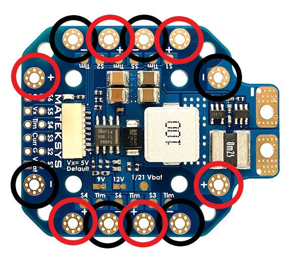

The ends of the motor connections being soldered will need to be reduced in size to fit through the solder pad holes.

With the wire end sticking through the hole, solder the exposed wire to the bottom solder pad of the PDB. The result should look as follows:

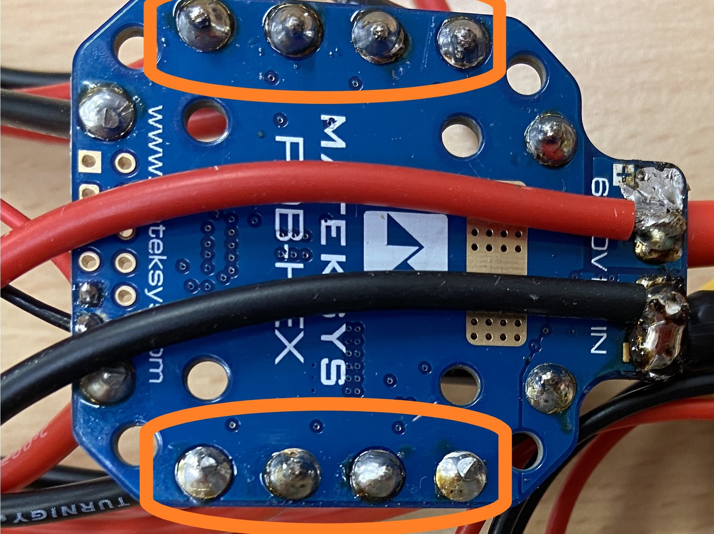

With all the motor connections solder, the end result should look as follows:

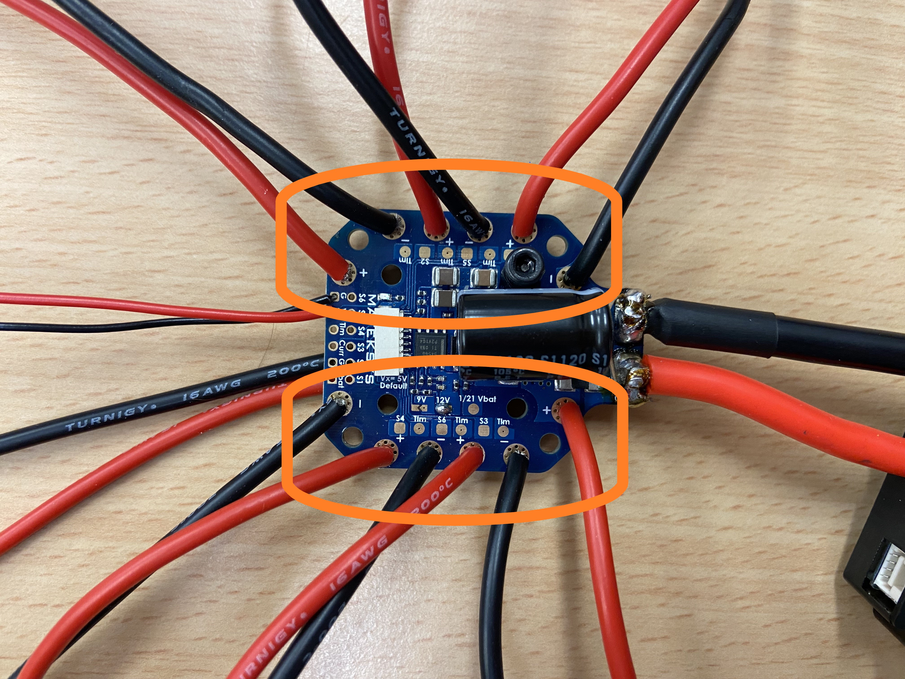

### Step 4: *Adding periphery wires*
Some components require an input voltage at the same voltage of the battery. This step outlines adding a periphery wire to connect things like the autopilot regulator and sensor regulators.

Looking at the bottom of the PDB, the input voltage pads will be used to solder on the periphery wires. 

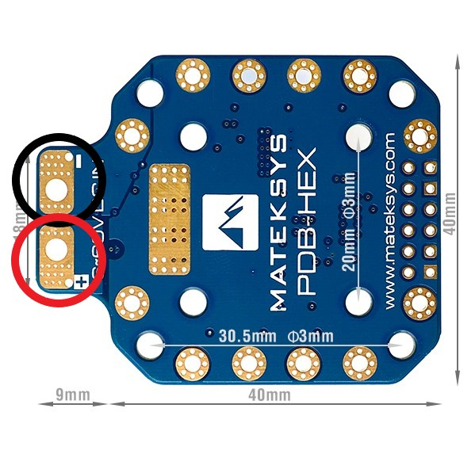

Take the periphery wire with two **XT30** male connectors on the end and solder it to the pads shown above. The wire ends **do not** need to go through the holes here.

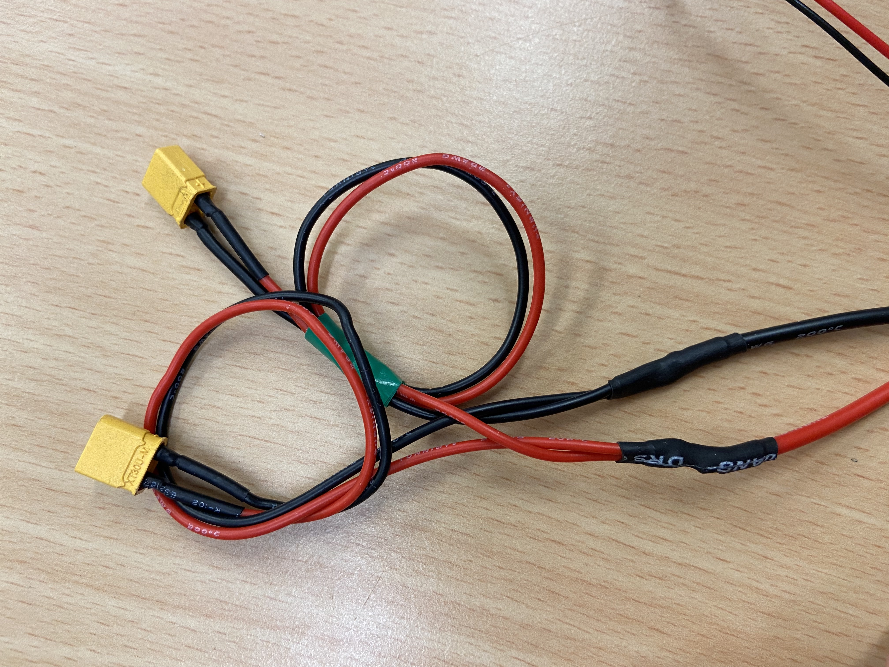

The result should appear similar to this:

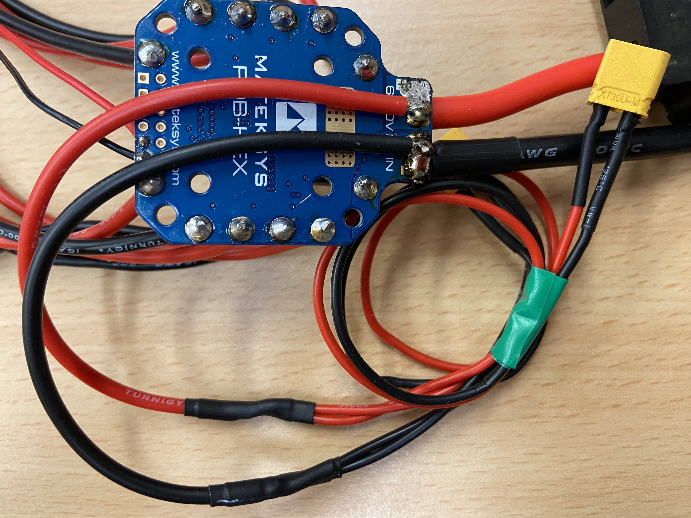

### Step 5 (Optional): *PDB voltage regulator*
The PDB comes with an internal voltage regulator that can output 5V, 9V or 12V at 4A.

The standard output is 5V, if one of the solder pads is connected then the output voltage will match the label.

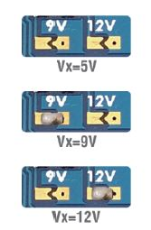

The selected voltage is output from these solder pads and wires with the desired connectors can be fixed here. **Vx** is the positive terminal and **G** is the negative or ground terminal.

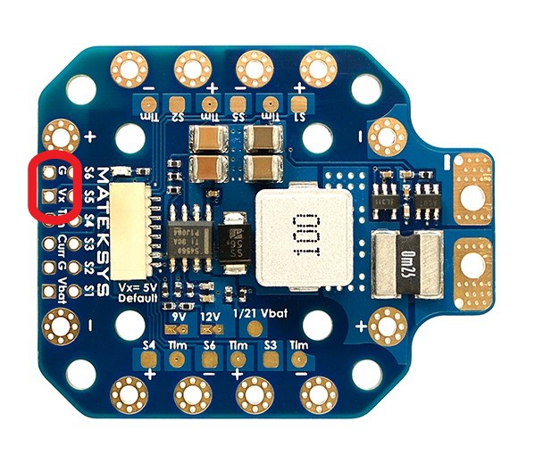

These solder pads can be used for flight LEDs or to power other peripheries just ensure the output voltage matches the requirements of the component in use.

## Mounting the PDB
Satisfied that the required solder on the PDB is complete, it can not be mounted to the Bottom Plate of the Central Hub.

### Step 1: *Fixing the PDB to the plate*
The PDB will be fixed to the bottom plate via two means, a 3D print with embedded nuts and velcro to secure the 3D print. The velcro is beneficial if the PDB location needs to change, i.e. for reconfiguration between Hex and Quad.

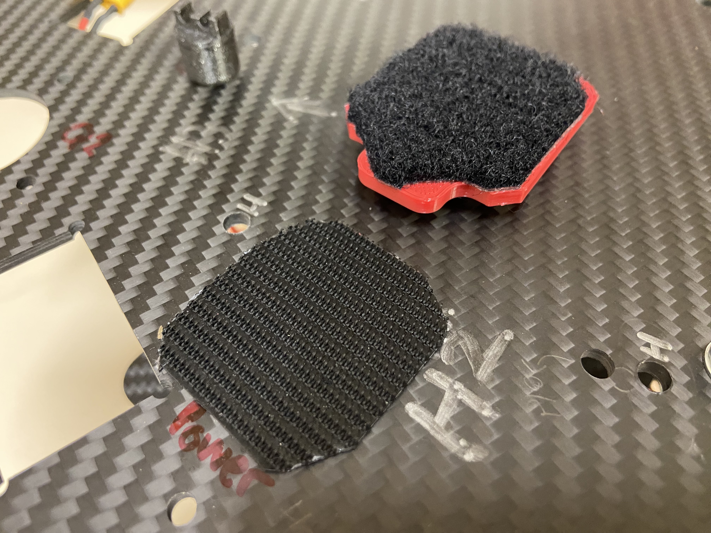

The PDB should be placed towards the back of the Bottom plate as shown bellow. Configuration markings assist with good placement of the velcro.

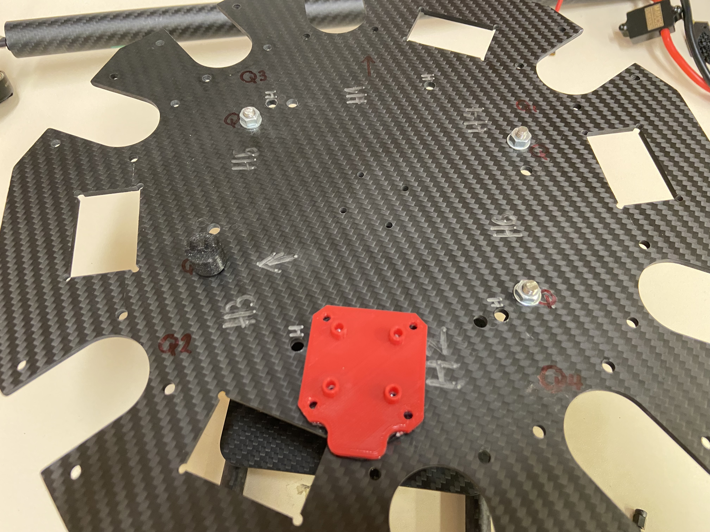

### Step 2: *Securing the PDB to the mount*
The PDB is secured to the printed mount with 2 **M3x12mm** hex socket bolts and 2 plastic insulators.

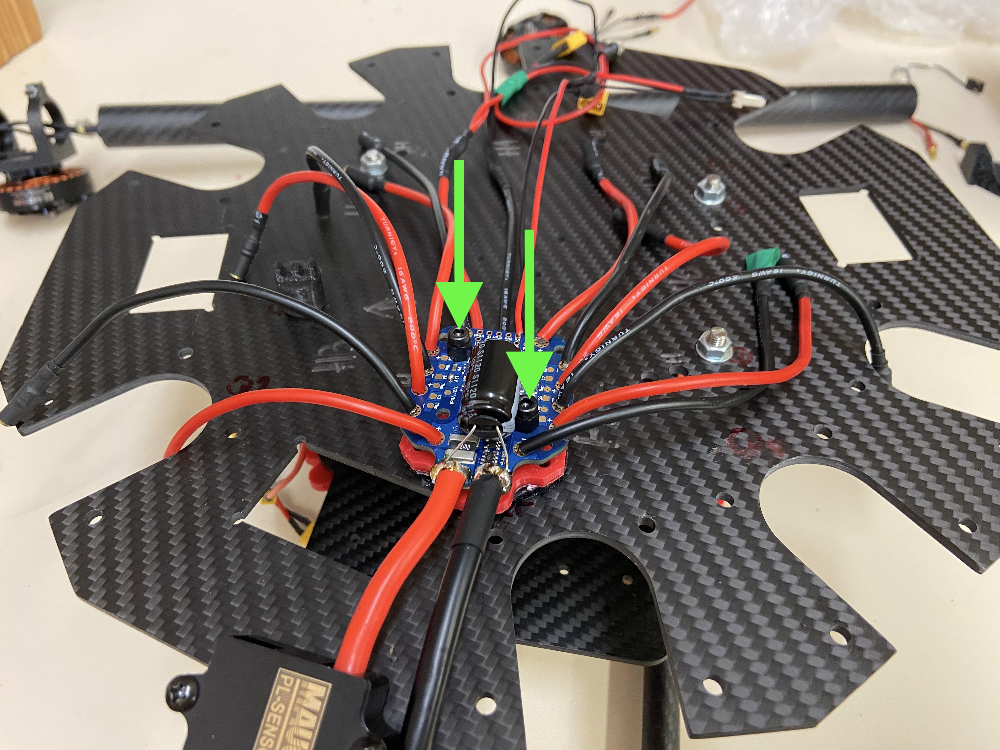

[Previous Section](../../GettingStarted/BuildInstructions/BatPlate.md.md){: .btn} [Next Section](../../GettingStarted/BuildInstructions/PDB.md.md){: .btn .float-right}

