# 3D Part Print Guide
{: .no_toc}

This document outlines everything required to print the associated parts in the intended way. It will highlight the correct print orientation, if a nut insert is present, the infill percentage and layer settings.

A number of the 3D printed parts contain nut inserts for added strength. A tutorial on how to embed nuts can be found here:

[3D Print Inserts](../../GettingStarted/Tutorials/3DPrintInserts.md){: .btn}

## Table of Content:
{: .no_toc .text-delta }

1. TOC
{:toc}

# WingNut Extender:

1 x M5 Nut
{: .label .label-red}

**Orientation:**

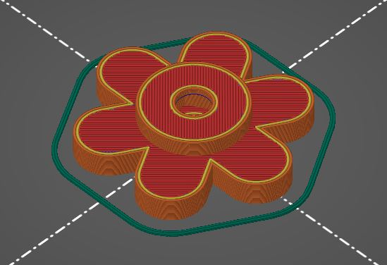

**Infill Percentage:** 30%

**Layer Thickness:** 0.2mm

# Landing Gear Tube Cap:

**Orientation:**

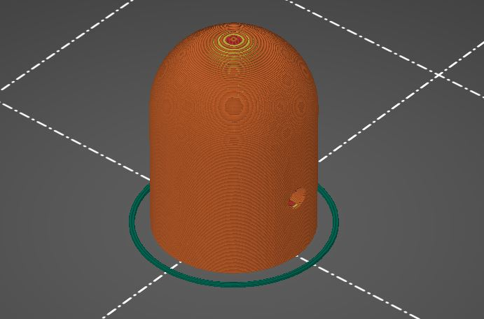

**Infill Percentage:** 15%

**Layer Thickness:** 0.2mm

# Top Rotor Boom Mount:

2 x M4 Nut
{: .label .label-red}

**Orientation:**

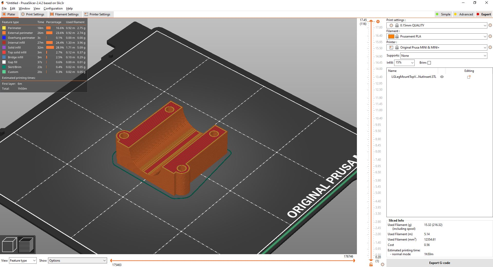

**Infill Percentage:** 30%

**Layer Thickness:** 0.2mm

# Bottom Rotor Boom Mount:

Requires Support Material
{: .label .label-green}

**Orientation:**

**Infill Percentage:** 30%

**Layer Thickness:** 0.2mm

# Motor Mount:

Requires Support Material
{: .label .label-green}

**Orientation:**

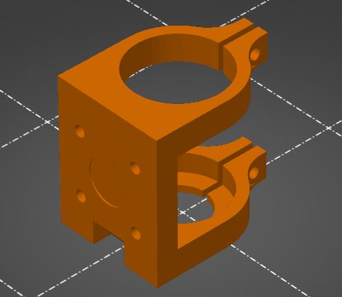

**Infill Percentage:** 50%

**Layer Thickness:** 0.2mm

# Top Rail Mount:

3 x M3 Nuts
{: .label .label-red}

**Orientation:**

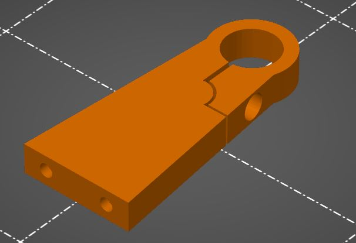

**Infill Percentage:** 30%

**Layer Thickness:** 0.2mm

# Bottom Rail Mount:

2 x M3 Nuts
{: .label .label-red}

1 x M5 Nuts
{: .label .label-red}

Requires Support Material
{: .label .label-green}

**Orientation:**

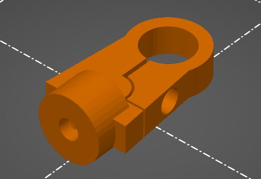

**Infill Percentage:** 50%

**Layer Thickness:** 0.2mm

# GPS Mount:

Requires Support Material
{: .label .label-green}

**Orientation:**

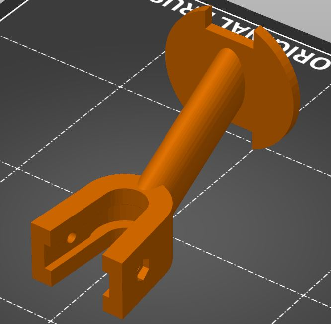

**Infill Percentage:** 30%

**Layer Thickness:** 0.2mm

# PDB Mount:

4 x M3 Nuts
{: .label .label-red}

**Orientation:**

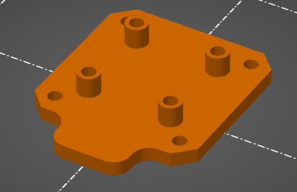

**Infill Percentage:** 30%

**Layer Thickness:** 0.2mm

# Nut Insert Tube Mount:

1 x M3 Nuts
{: .label .label-red}

**Orientation:**

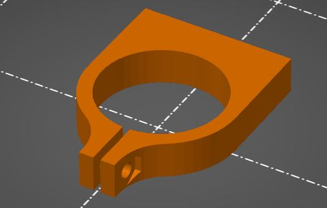

**Infill Percentage:** 30%

**Layer Thickness:** 0.2mm

# RC Receiver Mount:

Requires Support Material
{: .label .label-green}

**Orientation:**

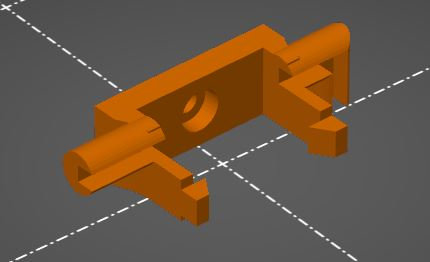

**Infill Percentage:** 30%

**Layer Thickness:** 0.2mm

# Telemetry Radio Mount:

**Orientation:**

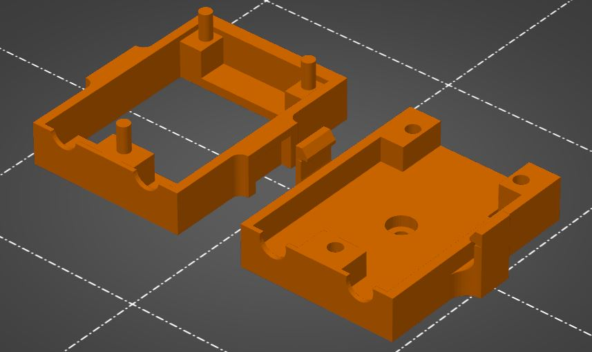

**Infill Percentage:** 30%

**Layer Thickness:** 0.2mm