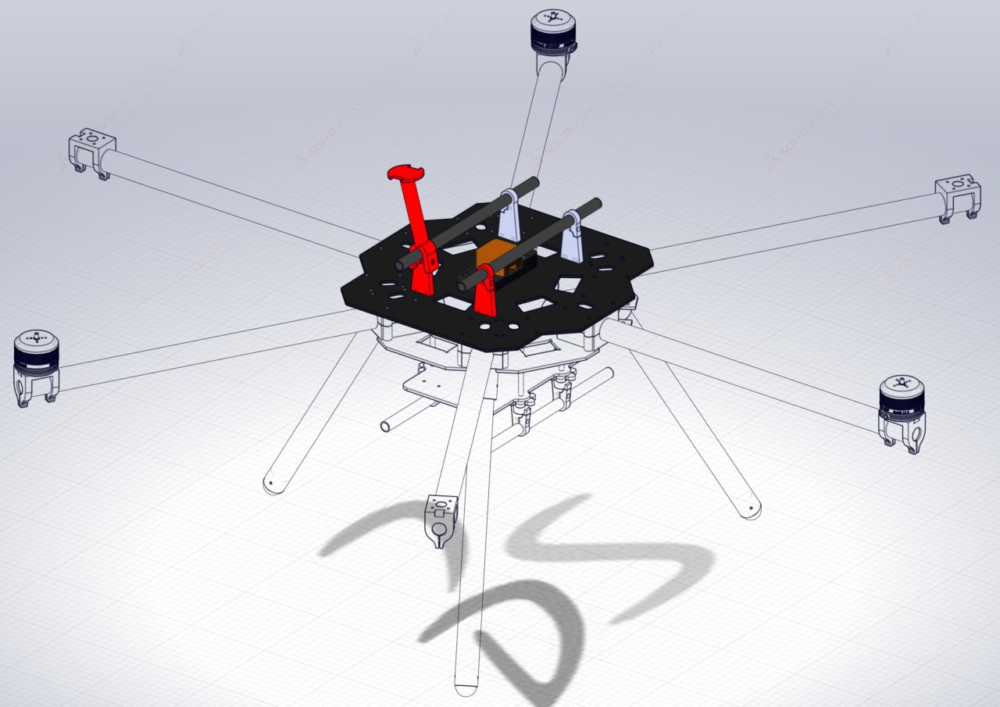
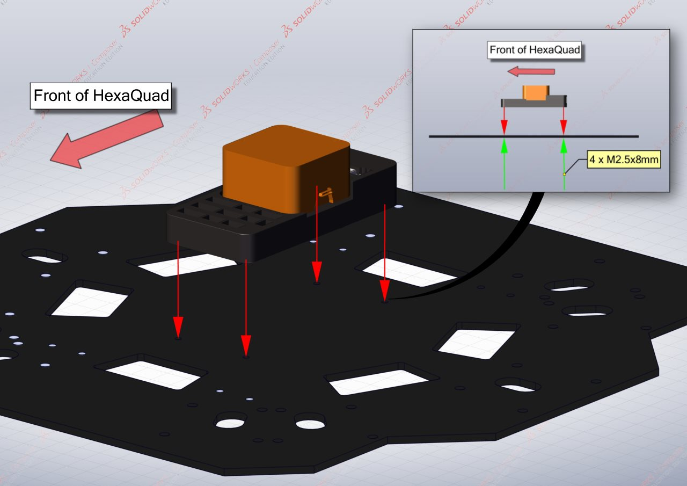
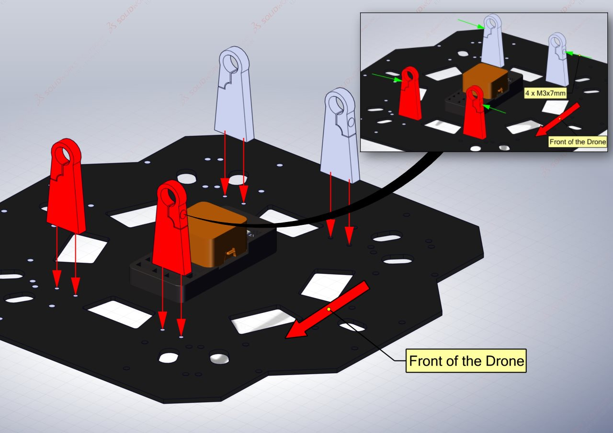
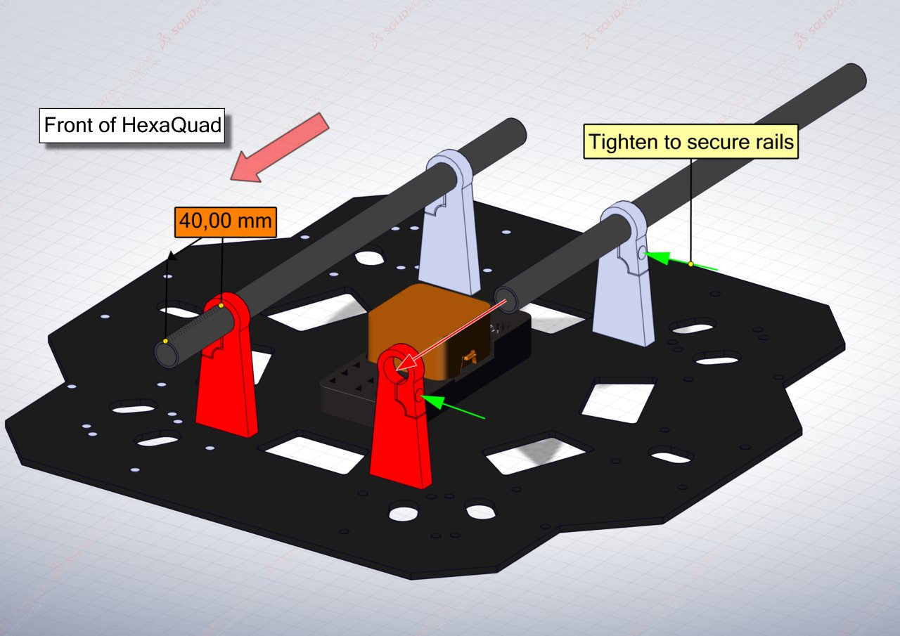
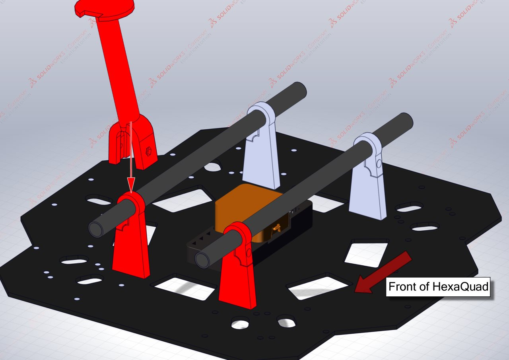

# Top Plate of the Central Hub
{: .no_toc }
The central hub is made up of three different plates each housing different electronics. The focus here is on the top plate and mounting the components which are unlikely to be removed.

## Table of Content:
{: .no_toc .text-delta }

1. TOC
{:toc}

## Requirements: 

### Parts:

| Component              | Quantity | Description                          |
|:------------------------|:--------------|:-------------------------|
| [Oblong Top Plate](https://github.com/landrs-toolkit/LANDRs-Science-Drone/tree/main/Design/MechanicalDesign/CenterHubs/TopPlate) | 1 | CNC'd carbon fiber plate |
| Cube Orange | 1| CubePilot flight controller and standard board    |
| [Top Rail Mount](https://github.com/landrs-toolkit/LANDRs-Science-Drone/tree/main/Design/MechanicalDesign/RailMounting) | 4 | 6S 340KV electric motor |
| Gimbal Rails | 2 | 12x10x250mm carbon fiber tube|
| M2.5 x 8mm screw | 4| M2.5 screw to secure the flight controller|
| M3 x 8mm bolt | 12 | M3 hex socket bolts for gimbal mounts|

*Note: It's suggested to print two of the top gimbal mounts in one filament colour and the remain two in another colour. This assists with identifying orientation of the HexaQuad.*

## Assembling the Oblong Top Plate:
The following illustration will assist with mounting the components that go on the top plate. The top plate is the same for both configurations of the HexaQuad.

### Step 1: *Attaching the flight controller*

The top plate is symmetrical and thus the flight controller can be mounted facing either direction. Once a direction is chosen it is best to stick with it. There is an indicator arrow on the top of the Orange Cube indicating the forward direction.

The flight controller is secured to the top plate with **4 x M2.5x8mm** screws. The mounting holes are illustrated above.

### Step 2: *Mounting the rail mounts*
There are four rail mounts located on the top plate. Each one is fixed to the top plate by **2 x M3x8mm** hex socket bolts. The rail mounts should be orientated with the hole to secure the rail facing out from the center of the plate.

**FIX THE IMAGE!**

**4 x M3x8mm** hex socket bolts can be threaded into the part of the rail mounts that secure the rail. This is highlighted in the detailed view by the green arrows.

### Step 3: *Securing the gimbal rails*
The two carbon fiber gimbal rails (**12x10x250mm**) can now be secured in the rail mounts. Slide the rails through the eye of the mounts, the end of the tube should be **40mm** from the end of the rail mount as shown below.

The rail is secured in place by tightening the four bolts in the side of the rail mounts. **DO NOT** over tighten these bolts as it will break through the 3D prints.

### Step 4: *Mounting the GPS stand*
The GPS mount was designed to snap fit onto one of the rail mounts. Thus, it does not require any bolts to secure it.

The GPS should be mounted at the front of the HexaQuad as illustrated below. It is mounted at the front to isolate it from the power systems interference which is located at the back of the HexaQuad.

[Previous Section](../../GettingStarted/BuildInstructions/Rotorbooms.md){: .btn .mr8} [Next Section](../../GettingStarted/BuildInstructions/TopPlate.md){: .btn}

