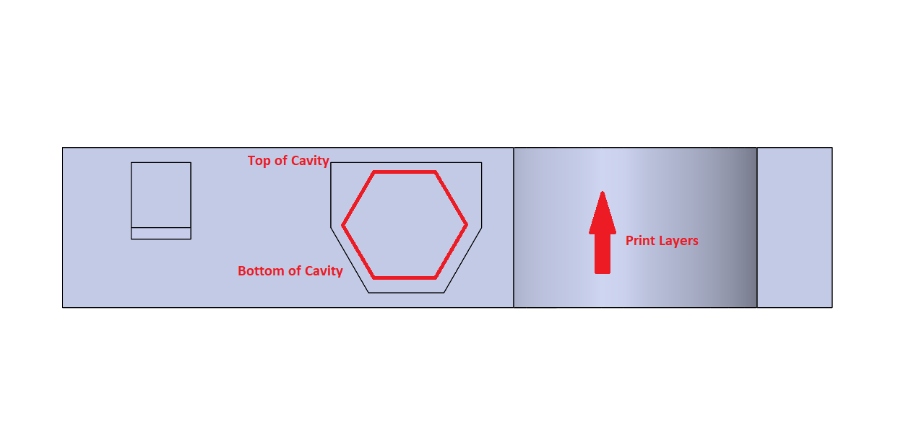
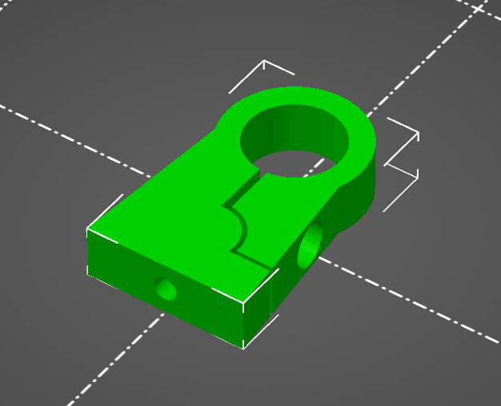
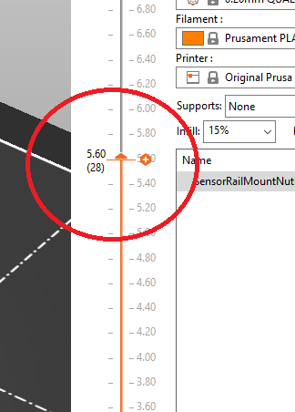
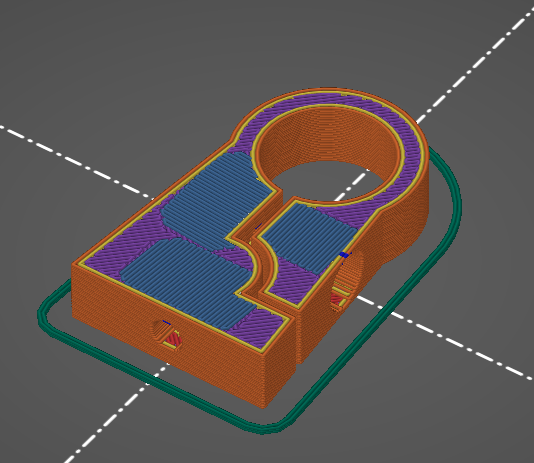
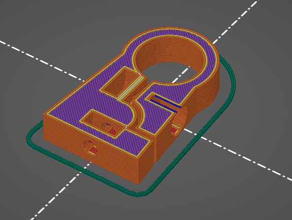

# Adding Inserts to 3D Prints:
Adding items into the 3D prints can be extremely useful and often simplify designs.
It has become quite a common task to embed bearings or nuts into 3D prints. Reason being, it allows complex parts to be created through 3D printing but at the same time provided superior mechanical performance compared to 3D printed equivalents.

## Design of the 3D Print:
Coming Soon... Basically, you have to create a cavity you can slip the nut or bearing into. The cavity must be large enough to house the component in its entirety, otherwise it make contact with the head of printer. Sometimes the cavity can be the shape of the component but this is usually influenced by the print orientation.

# Embedding a Nut in a 3D Print:
The following steps are for a PrusaMini, however there are concepts that can be transferred to other printers.

## Step 1, Correct Orientation of the Print:
Ensure the part is oriented on the print plate such that a pause can be added to insert a nut into the cavity. If the cavity is printed in reverse, you **will not** be able to insert the nut.

## Step 2, Slicing and Adding a Pause: (Prusa Specific)
Prusa already have great documentation on this and it can be found [here](https://help.prusa3d.com/article/insert-pause-or-custom-g-code-at-layer_120490).

However, simply put if you slide the orange layer slider on the right of the screen a "+" appears. Clicking this gives you the option to add a `Pause`, `Colour Change` or `Custom G-code` at the **current** layer. We desire a simple `Pause` only.

## Step3, Choosing the Correct Layer for a Pause
We only want to insert the nut into the cavity just before the cavity closes. If we insert the nut before this point it will leave a portion of the nut protruding from the cavity and can collide with the extruder. The idea then, is to determine at which layer the cavity closes.

There are two layers you must find to add a successful pause. The Layer that the **cavity closes** and the layer **before** the cavity closes.

**Layer When Cavity Closes**

**Layer Before Cavity Closes**

We want to add the pause on the layer **BEFORE** the cavity closes. On the layer before the cavity closes, add the pause as described in **Step 2**.
You can then slice the print and export the G-code for printing.

Happy Printing!
